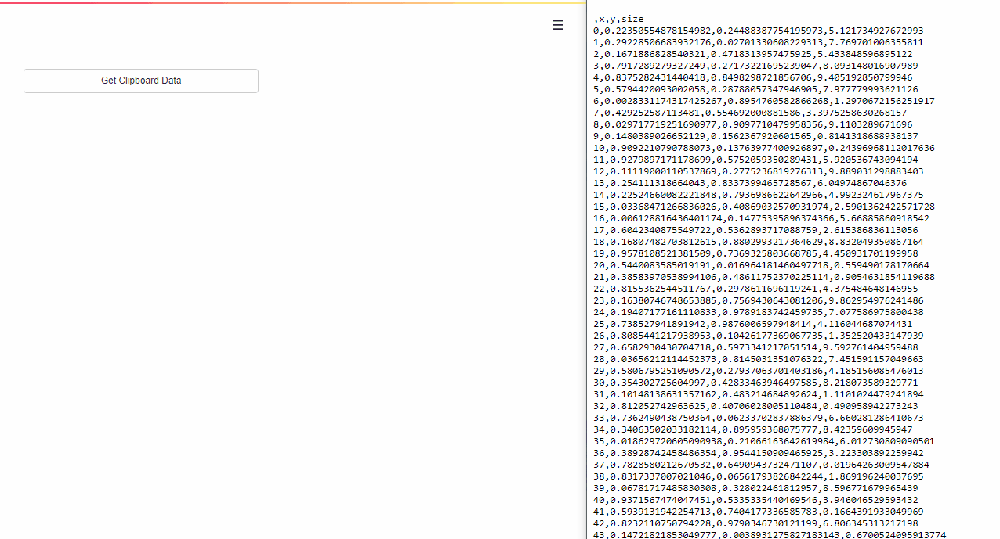

# streamlit-bokeh3-events
A streamlit component for bi-directional communication with bokeh 3 plots. This update is based on the following archived repository from ash2shukla: https://github.com/ash2shukla/streamlit-bokeh-events

# :streamlit: App
Try it out yourself in my example :streamlit: [app](https://bokehevents.streamlit.app/).

# General remarks
The original implementation of ash2shukla looks very promising, however, I was not able to get it running on my system. Moreover, it does not support bokeh3 and is not maintained anymore. For this repository, I took the code from ash2shukla and updated it to work with bokeh3.

# Installation
```bash
pip install streamlit-bokeh3-events
```

# Demo

#### Plots

---
#### Widgets

#### Data Tables


#### Color Picker


#### Run Any Custom JS


#### Get data from Clipboard



# Usage

The folder ```examples``` contains a few examples of how to use the component.
